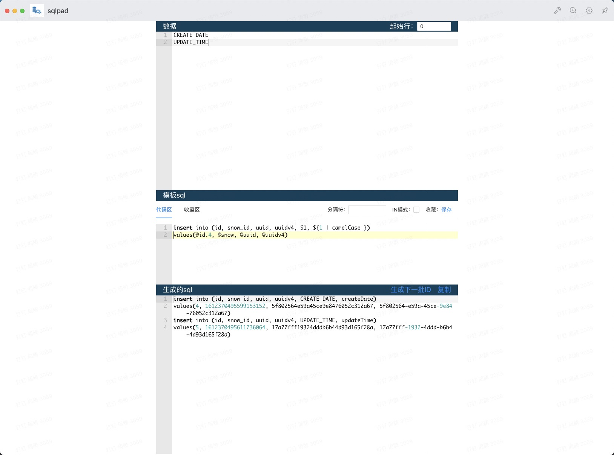

# sql代码生成器

## 界面介绍
1. 数据区
2. 模板sql代码区
3. 生成sql区

## 使用方法
1. 将数据放入数据区，按行分割
  a. 模板sql中可以选择分隔符，默认空格，可以选择，等

2. 在模板sql写入sql
  a. 其中$1代表第一个元素，$n代表第n个元素
  b. in模式将所有行合并成一个
  c. 收藏，收藏当前模板sql

3. 生成的sql
  a. 包含所有生成的sql
  b. 点击复制复制所有sql
  c. 点击生成下一批ID更换生成的ID

## 模板sql规则

1. $1代表第一个元素，$n代表第n个元素 
2. 增强变量表达需要用大括号 ${1}
3. `@id`表示自增id, `@id.10`表示从10开始自增
4. `@snow`表示雪花id
5. `@uuid`表示生成uuid并移除"-"
6. `@uuidv4`表示成功uuid

### 增强变量表

支持过滤器，过滤器方法均来自lodash，可以参考lodash文档。
额外自定义过滤器`qutote(str, q = "'")`,q默认值为', 可以使用`${1 | quote}或者${1 | quote("`")}`。

比如`${1 | camelCase }`, 将变量1转换成驼峰形式