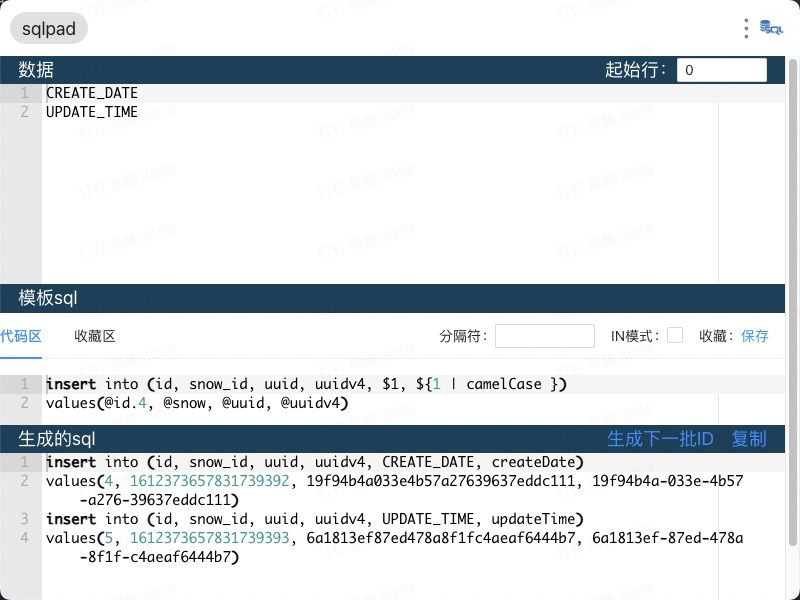

# sql代码生成器

## 使用方法

* `yarn start`启动本地调试
* `yarn build`打包后部署到自己的网站使用

## 界面介绍
1. 数据区
2. 模板sql代码区
3. 生成sql区



## 使用方法
1. 将数据放入数据区，按行分割
    1. 模板sql中可以选择分隔符，默认空格，可以选择，等

2. 在模板sql写入sql
    1. 其中$1代表第一个元素，$n代表第n个元素
    2. in模式将所有行合并成一个
    3. 收藏，收藏当前模板sql
    4. 支持#1代表第一行

3. 生成的sql
    1. 包含所有生成的sql
    2. 点击复制复制所有sql
    3. 点击生成下一批ID更换生成的ID

## 模板sql规则

1. $1代表第一个元素，$n代表第n个元素 
2. 增强变量表达需要用大括号 ${1}
3. `@id`表示自增id, `@id.10`表示从10开始自增
4. `@snow`表示雪花id
5. `@uuid`表示生成uuid并移除"-"
6. `@uuidv4`表示成功uuid
6. `@now`时间戳
6. `@datetime`时间日期
6. `@date`日期

### 增强变量表达式

支持过滤器，过滤器方法均来自lodash，可以参考lodash文档。
额外自定义过滤器`qutote(str, q = "'")`,q默认值为', 可以使用``${1 | quote}或者${1 | quote("`")}``。

比如`${1 | camelCase }`, 将变量1转换成驼峰形式。

\#表示行数, #0默认输出第一行。
```
数据区
模板区， 起始行1
-------------
id user_name
abc_def gh_ef
abc_def gh_ef
模板区
-------------
insert (#{0 | camelCase | quote}) values ($0)
-------------

生成区
-------------
insert ('id','userName') values (abc_def,gh_ef)
insert ('id','userName') values (abc_def,gh_ef)
-------------
```
上述可以理解为，第0行先进行驼峰命名，然后再添加引号。如果只输入#0, 则返回
`insert (abc_def,gh_ef) values (abc_def,gh_ef)`。

上述可以等价为`insert (#{0 | map(_.camelCase) | map(_.ary(_.quote)) }) values ($0)`,本质上#0会返回数组，
所以需要`lines.map(_.ary(_.quote))`,ary含义可以自行百度，如果在行匹配没有找到map，则自动进行map操作。

